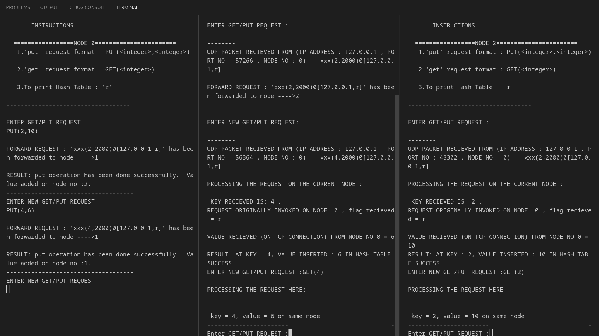

# DistMemoryFacade
Distributed system offering unified memory access across multiple nodes, providing an illusion of a single, large memory chunk. Inspired by models like Hadoop's DFS. Built primarily in C with socket programming.


```lua
       +----------------------UDP/TCP----------------------+
       |                                                    |
       |                                                    |
       v                                                    |
  +--------+      UDP/TCP      +--------+      UDP/TCP      |
  | Node 1 |------------------>| Node 2 |------------------>| Node 3 |
  +--------+  GET / PUT        +--------+  GET / PUT        +--------+
       ^                                                    |
       |                                                    |
       |                                                    |
       +---------------------UDP/TCP------------------------+
```

## Table of Contents :scroll:

1. [Introduction](#introduction)
2. [Problem Statement](#problem-statement)
3. [Hadoop Distributed File System Simulation](#hadoop-distributed-file-system-simulation)
4. [Features](#features)
5. [Code Overview](#code-overview)
6. [Pseudocode](#pseudocode)
7. [Technologies](#technologies)
8. [Getting Started](#getting-started)
9. [Usage](#usage)
10. [Output Explanation](#output-explanation)
11. [Displaying the Hash Table](#displaying-the-hash-table)
12. [Contributing](#contributing)
13. [License](#license)
14. [Acknowledgments](#acknowledgments)


# Distributed Transparent Memory 🌐💽

## Description 📝

Distributed system offering unified memory access across multiple nodes. Users experience the illusion of accessing a large contiguous memory space, even though it's distributed across several machines.
# Problem Statement: Distributed Transparent Memory

**Objective:**  
To develop a distributed system that offers a unified memory access experience across multiple nodes. Despite the memory being scattered across different physical machines, the end user should perceive it as a single, contiguous chunk of memory.

**Background:**  
In today's data-driven world, there's an increasing need to store and manage vast amounts of data. Traditional single-machine memory models often don't suffice for the voluminous data storage needs. Distributed memory models, such as the one used by the Hadoop Distributed File System (HDFS), allow data to be stored across several machines, taking advantage of combined storage capacities.

**Challenges:**  
1. **Distributed Architecture**: Memory is fragmented across different physical machines, and accessing it in a unified manner is a challenge.
  
2. **Transparency**: The end user should remain unaware of the underlying distribution of data. They should not need to track where particular chunks of their data reside.

3. **Network Overhead**: Since the memory access occurs over a network, there can be latency and other network-related challenges to address.

4. **Consistency**: Ensuring data consistency in such distributed environments, especially with concurrent access, can be challenging.

**Specifications:**  
1. **Language**: The primary language of choice is C due to its efficiency in memory management and low-level operations. However, other languages with socket programming knowledge, such as C++, Python, and Java, are also permissible.

2. **Nodes**: Consider a scenario with four physical machines, each having a hard drive of 2 GB. The user should perceive this as a single 8 GB memory chunk, even though it's distributed.

3. **User Interaction**: There will be a network layer between the user and the memory storage. The user interacts with this network layer, which in turn communicates with the distributed nodes.

4. **Data Retrieval**: The system should ensure swift data retrieval without the user needing to know from which physical machine the data is fetched.

**End Goal:**  
To present the end user with the illusion that they're accessing a large, unified memory chunk, even though the memory is distributed across multiple physical nodes.

# Distributed Hash Table Implementation :earth_americas: :floppy_disk:


## Introduction :book:

This repository contains an implementation of a Distributed Hash Table (DHT), which provides a decentralized way of storing data. This implementation supports `GET` and `PUT` operations and is designed to work in a network of nodes.

## Problem Statement :question:

The challenge is to create a distributed system that mimics the behavior of a large-scale key-value store. The system should be able to handle `GET` and `PUT` requests, route these requests to the appropriate nodes based on keys, and work in a network with an arbitrary number of nodes.

## Hadoop Distributed File System Simulation :elephant:

This project serves as a simplified simulation of the Hadoop Distributed File System (HDFS). In HDFS, data is stored across multiple nodes and can be accessed in a distributed manner. Our implementation utilizes a similar architecture, with nodes in a network each taking on the responsibility of storing a subset of keys in the hash table.

## Features :sparkles:

- :mag_right: `GET` - Retrieve a value based on its key.
- :memo: `PUT` - Insert a key-value pair into the distributed hash table.
- :arrows_counterclockwise: Automatic key-value forwarding to appropriate nodes.
- :computer: TCP and UDP networking.

## Code Overview :page_with_curl:

The project mainly consists of three parts:

1. **UDP Socket Programming**: Responsible for the communication between nodes in a distributed manner.
2. **TCP Socket Programming**: Handles `GET` and `PUT` operations.
3. **Distributed Hash Table (DHT)**: The core logic for storing and retrieving key-value pairs.

Files:

- `dht.c` - Main implementation file.

## Pseudocode :pencil:

```plaintext
    Initialize UDP and TCP sockets
    Bind UDP and TCP sockets to ports
    Listen for incoming TCP connections
    Initialize readfds (file descriptor set)
  
    While True:
        Clear readfds
        Add UDP socket, TCP master socket, and stdin to readfds
        Call select() to watch readfds
        
        // Handle UDP Activity
        If UDP socket is ready:
            Receive UDP packet into buffer
            If packet starts with 'PUT':
                Extract key-value from packet
                If key falls in local node's range:
                    Insert key-value pair into Hashtable
                Else:
                    Forward packet to next node via UDP
            ElseIf packet starts with 'GET':
                Extract key from packet
                If key falls in local node's range:
                    Retrieve value from Hashtable
                    Send value to requesting node via TCP
                Else:
                    Forward packet to next node via UDP
        
        // Handle TCP Activity
        If TCP master socket is ready:
            Accept incoming TCP connection
            If previously performed GET:
                Read value from Hashtable
                Send value to connected client
                Close TCP connection
            ElseIf previously performed PUT:
                Read value from connected client
                Insert into Hashtable
                Close TCP connection
        
        // Handle Standard Input
        If stdin is ready:
            Read command from stdin
            If command is 'put':
                Extract key-value
                Insert into Hashtable or forward to next node via UDP
            ElseIf command is 'get':
                Extract key
                Retrieve value from Hashtable or forward to next node via UDP
            ElseIf command is 'r':
                Print Hashtable

Function forwardUDP(destination_node, message):
    Create UDP socket
    Set destination address and port
    Send message to destination
    Close UDP socket
```

## Technologies :wrench:

- C
- UDP and TCP Sockets

## Getting Started :rocket:

### Prerequisites :clipboard:

- gcc compiler
- Terminal

### Installation :floppy_disk:

1. Clone the repository:
    ```
    git clone 
    ```
2. Navigate to the directory:
    ```
    cd your-repo-name https://github.com/ANSANJAY/DistMemoryFacade
    ```
3. Compile the source code:
    ```
    gcc -o dht dht.c
    ```
Certainly, here's a sample `README.md` file with emojis to make it more engaging. Just copy and paste the below text into your README file.

---

## Usage 💻

To start the program and initialize your 3-node token ring topology, follow these steps:

rum the make command which will make `node0`,`node1`,`node2`

```bash
make
```

1️⃣ Open three different terminal windows.

2️⃣ In the first terminal window, compile and run `node0.c`:
```bash
./node0
```

3️⃣ In the second terminal window, compile and run `node1.c`:
```bash
./node1
```

4️⃣ In the third terminal window, compile and run `node2.c`:
```bash
./node2
```

📘 Each node terminal will display instructions for interacting with the distributed hash table.

---

## Output Explanation 📖

### Node Instructions 📜

Each terminal will display similar instruction sets:

- **PUT request**: To insert a value into the hash table, use the format `PUT(<key>,<value>)`. 📥
- **GET request**: To retrieve a value from the hash table, use the format `GET(<key>)`. 📤
- **Hash Table**: To view the current state of the hash table, enter `r`. 📚

### Distributed Hash Table Operations 🌐

📝 Here's a breakdown of the operations:

#### PUT Operation 📥

1. **Forward the Request** 📡: If the node isn't responsible for the key, it will forward the request to the next node.
```plaintext
FORWARD REQUEST : 'xxx(2,2000)0[127.0.0.1,r]' has been forwarded to node ---->1
```

2. **Process Locally** 🏠: If the node is responsible for the key, it processes the request locally.
```plaintext
PROCESSING THE REQUEST HERE:
RESULT: AT KEY : 3, VALUE INSERTED : 10 IN HASH TABLE SUCCESS
```


#### GET Operation 📤

🔍 The GET operation behaves similarly to the PUT operation.


### UDP Communication 📡

Nodes communicate through UDP packets.
```plaintext
UDP PACKET RECEIVED FROM (IP ADDRESS : 127.0.0.1 , PORT NO : 52071 , NODE NO : 0)  : xxx(2,2000)0[127.0.0.1,r]
```





---

## Displaying the Hash Table 📊

### Command 📝

To view the hash table for any node, simply enter `r`. This will display the current state of that node's hash table.

### Example Output 👀

#### Terminal 1 (Node 0) 🖥

After several `PUT` operations, Node 0 has the following in its hash table:
```plaintext
-----Hash Table Contents(0--297)------------
key : 3 ===== value : 5
```

#### Terminal 2 (Node 1) 🖥

After several `PUT` operations, Node 1 has the following in its hash table:
```plaintext
-----Hash Table Contents(1--298)------------
key : 7 ===== value : 3
```


### Explanation 📚

1. **key : X ===== value : Y**: This shows the key-value pair that the node currently maintains.
  
2. **Hash Table Contents(X--Y)**: This indicates the range of keys for which the node is responsible.

---

## Contribution Guidelines 🤝

Interested in contributing? We welcome pull requests, bug fixes, and issue reports. Before proposing a change, discuss it via issues.

## License :scroll:

This project is licensed under the MIT License - see the [LICENSE.md](LICENSE.md) file for details.


Made with ❤️ by Anamika
